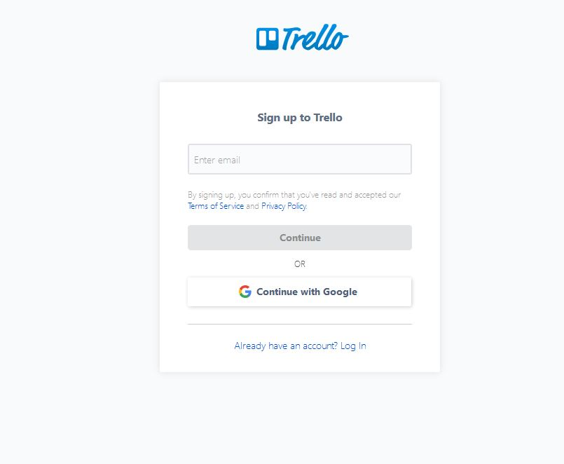
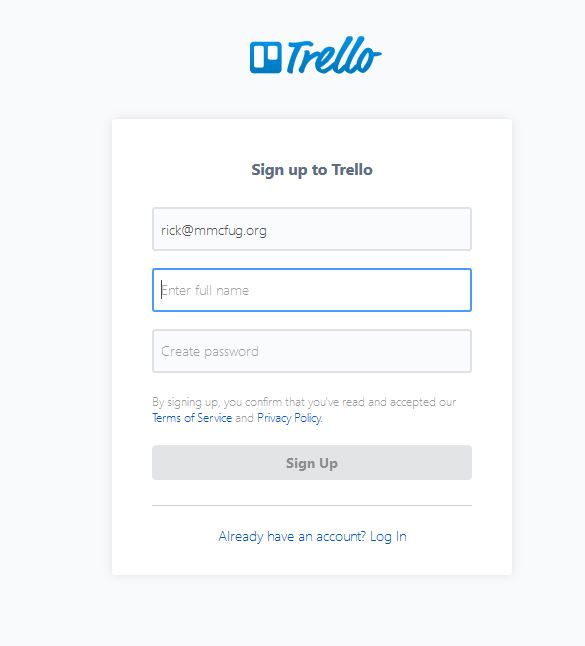
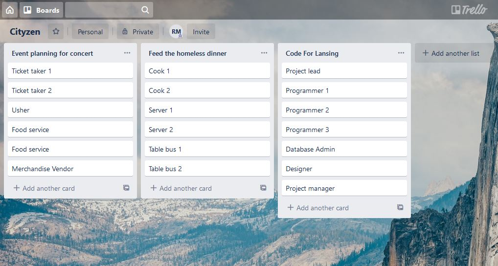

<nav class="navbar navbar-dark fixed-top bg-dark flex-md-nowrap p-0 shadow"><a href="/readme.md">CityZen</a></nav>

<nav class="col-md-2 d-none d-md-block bg-light sidebar">

*   [Introduction (current)](/readme.md)

###### Setup[](#)

*   [Setting up Trello](/setting-up-trello.md)
*   [Setting up CityZen](/setting-up-cityzen.md)

###### Developers[](#)

*   [NPM Install](/npm-install.md)
*   [GitHub Install](/github-install.md)
*   [Docker Install](/docker-install.md)
*   [Link Trello](/link-trello.md)

###### Meta[](#)

*   [Meet the team](/meet-the-team.md)

</nav>

<main role="main" class="col-md-9 ml-sm-auto col-lg-10 px-4">

# Setting up Trello

Here's how to create an account on Trello and create your first project. Sign up for Trello by selecting the sign up link at the top right of the home page at https://www.trello.com Now it ask for you to enter your email:

After hitting continue you're presented with a second page that asks for your name and asks you to enter a password. Note the password must be eight characters long or you cannot proceed.

Now we're ready to create 'cards' which in Trello which will represent your projects. In each project you can list individual tasks. Trello calls the card titles lists. So creating a list is naming a card. Then you're asked to add a card which is what Trello calls adding a task.

By grabbing the titles of the cards you can drag them around to change their order. So if you have a new project and want it to be first on your web page drag it to first in Trello and it will be reflected on your website. If you're interested in video tutorials for advanced Trello topics you can find them [here.](https://blog.trello.com/press-play-the-trello-tutorial-video-series-is-here)

<a href="setting-up-cityzen.md">Setting Up CityZen</a>

</main>

